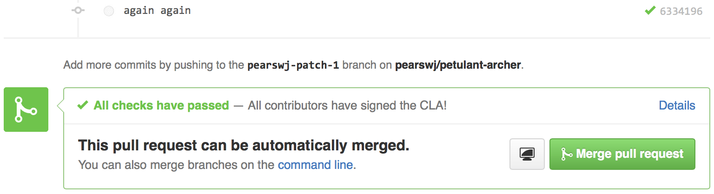

# clam

Yet another Contributor License Agreement Manager with webhooks and whatnot.

Designed to be dead-simple&trade;, Clam helps you manage a single CLA for your GitHub organisation. Watch out though,

The aim is to make it easy...

- (a) for maintainers to merge compliant contributions
- (b) for contributors to ensure they're compliant

Using webhooks Clam checks the contributors of a pull request against its signatory database and sets the status of the branch `HEAD` commit accordingly. GitHub lovingly renders this useful information for you right there in the pull request.



Remember this tool only provides guidance. Clam will not fix your bugs for you. Neither will it do the washing up.

A couple of exemptions apply, neither of which will trigger a failure:

1. Anyone with who [publicises their membership of the organisation][org_api]
2. Any collaborators with push access to the repository

Both of these groups are considered to be inside the circle of trust.


## Configuration

To keep things simple, I've hardcoded the organisation name and opted to use a [personal access token] to authorise calls to the GitHub API where necessary. Set `CLAM_GITHUB_ORG` and `CLAM_GITHUB_TOKEN` accordingly. The personal access token requires the `repo` scope to set commit statuses and query repo collaborators.

To authenticate signatories you'll need to register for a new [developer application] and set the values of `CLAM_GITHUB_CLIENT_ID` and `CLAM_GITHUB_CLIENT_SECRET` accordingly. Access to private information is not required; This process is in place simply to ensure that signatories can only sign for GitHub accounts that they have access to, therefore only the username is stored after authentication. For the callback url use "hostname/_auth", for example
```
https://clam-example-57.herokuapp.com/_auth
```

Last, but by no means least, make sure you've got your CLA checked into the root of the repository as `CLA.<extension>`. I've enlisted the help of [GitHub Markup] to render HTML so the CLA can have any extension listed there including none at all (e.g. `CLA.md`).


## Usage

Clam was designed to be run on Heroku.

```
$ git clone https://github.com/mcneel/clam.git
$ cd clam
$ heroku create clam-example-57 # clam-example-57 is just an example!
$ heroku addons:create heroku-postgresql
$ heroku config:set CLAM_GITHUB_ORG=mcneel
$ heroku config:set CLAM_GITHUB_TOKEN=your_github_access_token_with_repo_scope
$ heroku config:set CLAM_GITHUB_CLIENT_ID=your_application_client_id
$ heroku config:set CLAM_GITHUB_CLIENT_SECRET=your_application_client_secret
$ git push heroku master
$ heroku run python
>>> from clam import db
>>> db.create_all()
Use exit() or Ctrl-D (i.e. EOF) to exit
```

Now simply add a webhook to your favorite repository.

```
https://clam-example-57.herokuapp.com/_github
```


## Local testing

For local testing I use [Foreman].

```
$ git clone https://github.com/mcneel/clam.git
$ cd clam
$ virtualenv venv
$ . venv/bin/activate
$ pip install -r requirements.txt
$ foreman run python clam.py
```

Don't forget to add the required environment variables (see [Heroku](#heroku)) to `.env`.

Running `python clam.py` in this way creates a local sqlite database for testing.

Tips for spoofing a pull request with curl (for my own notes, really)...
```
curl -d @test/pull.json -H "Content-Type: application/json" -X POST localhost:5000/_github
```

[org_api]: https://developer.github.com/v3/orgs/#list-user-organizations
[Foreman]: https://github.com/ddollar/foreman
[personal access token]: https://help.github.com/articles/creating-an-access-token-for-command-line-use/
[developer application]: https://github.com/settings/applications/new
[GitHub Markup]: https://github.com/github/markup#markups
